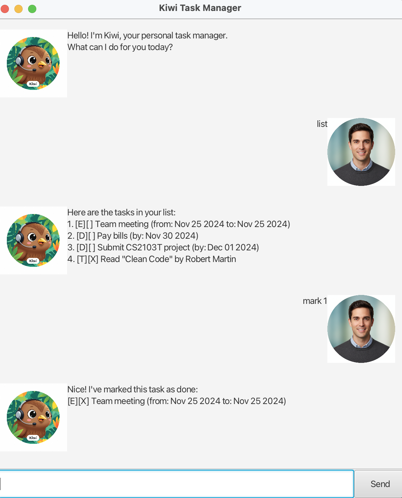

# Kiwi User Guide



Kiwi is a **desktop app for managing tasks, optimized for use via a Command Line Interface** (CLI) while still having the benefits of a Graphical User Interface (GUI). If you can type fast, Kiwi can get your task management done faster than traditional GUI apps.

## Quick Start

1. Ensure you have Java `17` or above installed in your Computer.
2. Download the latest `Kiwi.jar` from [here](https://github.com/ZayK1/ip/releases).
3. Copy the file to the folder you want to use as the _home folder_ for your Kiwi.
4. Open a command terminal, `cd` into the folder you put the jar file in, and use the `java -jar Kiwi.jar` command to run the application.<br>
   A GUI similar to the below should appear in a few seconds. Note how the app contains some sample data.<br>
5. Type the command in the command box and press Enter to execute it. e.g. typing **`help`** and pressing Enter will open the help window.<br>
6. Refer to the [Features](#features) below for details of each command.

## Features

> **Notes about the command format:**<br>
> 
> * Words in `UPPER_CASE` are the parameters to be supplied by the user.<br>
>   e.g. in `todo DESCRIPTION`, `DESCRIPTION` is a parameter which can be used as `todo read book`.
> 
> * Items in square brackets are optional.<br>
>   e.g `find KEYWORD` can be used as `find book` or just `find` (searches all tasks).

### Viewing help : `help`

Shows a message explaining how to access the help page.

Format: `help`

### Adding a todo task: `todo`

Adds a todo task to the task list.

Format: `todo DESCRIPTION`

Examples:
* `todo read book`
* `todo buy groceries`

```
Got it. I've added this task:
[T][ ] read book
Now you have 1 tasks in the list.
```

### Adding a deadline task: `deadline`

Adds a deadline task to the task list.

Format: `deadline DESCRIPTION /by DATE_TIME`

* The `DATE_TIME` can be in natural language (e.g., "tomorrow", "next Monday") or specific formats (e.g., "2024-12-01", "01/12/2024").

Examples:
* `deadline submit report /by 2024-12-01`
* `deadline homework /by tomorrow`

```
Got it. I've added this task:
[D][ ] submit report (by: Dec 1 2024)
Now you have 2 tasks in the list.
```

### Adding an event task: `event`

Adds an event task to the task list.

Format: `event DESCRIPTION /from START_TIME /to END_TIME`

Examples:
* `event project meeting /from 2024-11-20 /to 2024-11-21`
* `event conference /from Monday 2pm /to Monday 5pm`

```
Got it. I've added this task:
[E][ ] project meeting (from: Nov 20 2024 to: Nov 21 2024)
Now you have 3 tasks in the list.
```

### Listing all tasks : `list`

Shows a list of all tasks in the task list.

Format: `list`

```
You have 3 tasks in your list:
Here are the tasks in your list:
1. [T][ ] read book
2. [D][ ] submit report (by: Dec 1 2024)
3. [E][ ] project meeting (from: Nov 20 2024 to: Nov 21 2024)
```

### Marking a task as done : `mark`

Marks the specified task as done.

Format: `mark INDEX`

* Marks the task at the specified `INDEX` as done.
* The index refers to the index number shown in the displayed task list.
* The index **must be a positive integer** 1, 2, 3, …​

Examples:
* `list` followed by `mark 2` marks the 2nd task in the task list as done.

```
Nice! I've marked this task as done:
[D][X] submit report (by: Dec 1 2024)
```

### Unmarking a task : `unmark`

Marks the specified task as not done yet.

Format: `unmark INDEX`

Examples:
* `unmark 2` marks the 2nd task in the task list as not done yet.

```
OK, I've marked this task as not done yet:
[D][ ] submit report (by: Dec 1 2024)
```

### Finding tasks by keyword: `find`

Finds tasks whose descriptions contain the given keyword.

Format: `find KEYWORD`

* The search is case-insensitive. e.g `book` will match `Book`
* Only the description is searched.
* Tasks matching the keyword will be displayed.

Examples:
* `find book` returns tasks containing "book" in their description.
* `find meeting` returns tasks containing "meeting" in their description.

```
Here are the matching tasks in your list:
1. [T][ ] read book
2. [E][ ] project meeting (from: Nov 20 2024 to: Nov 21 2024)
```

### Finding tasks by date: `on`

Finds tasks that occur on a specific date.

Format: `on DATE`

* Shows all deadlines and events that fall on the specified date.
* Date format: `yyyy-mm-dd` or `d/m/yyyy`

Examples:
* `on 2024-12-01` shows all tasks on December 1, 2024.

```
Here are the tasks on Dec 1 2024:
1. [D][ ] submit report (by: Dec 1 2024)
```

### Sorting tasks chronologically: `sort`

Sorts all tasks by their dates in chronological order.

Format: `sort`

* Deadlines and events are sorted by their respective dates.
* Tasks with dates appear before tasks without dates.
* Todo tasks (no dates) maintain their original order.

```
Tasks have been sorted chronologically!
```

### Deleting a task : `delete`

Deletes the specified task from the task list.

Format: `delete INDEX`

* Deletes the task at the specified `INDEX`.
* The index refers to the index number shown in the displayed task list.
* The index **must be a positive integer** 1, 2, 3, …​

Examples:
* `list` followed by `delete 2` deletes the 2nd task in the task list.

```
Noted. I've removed this task:
[D][ ] submit report (by: Dec 1 2024)
Now you have 2 tasks in the list.
```

### Exiting the program : `bye`

Exits the program.

Format: `bye`

```
Bye! Hope to see you again soon!
```

### Saving the data

Kiwi data are saved in the hard disk automatically after any command that changes the data. There is no need to save manually.

### Editing the data file

Kiwi data are saved automatically as a text file `[JAR file location]/data/kiwi.txt`. Advanced users are welcome to update data directly by editing that data file.

> ⚠️ **Caution:**
> If your changes to the data file makes its format invalid, Kiwi will discard all data and start with an empty data file at the next run. Hence, it is recommended to take a backup of the file before editing it.

## FAQ

**Q**: How do I transfer my data to another Computer?<br>
**A**: Install the app in the other computer and overwrite the empty data file it creates with the file that contains the data of your previous Kiwi home folder.

**Q**: Can I use natural language for dates?<br>
**A**: Yes! Kiwi supports natural language dates like "tomorrow", "next Monday", etc., in addition to specific date formats.

**Q**: What happens if I enter an invalid command?<br>
**A**: Kiwi will show an error message and guide you on the correct format to use.

## Command Summary

| Action | Format, Examples |
|--------|------------------|
| **Add Todo** | `todo DESCRIPTION` <br> e.g., `todo read book` |
| **Add Deadline** | `deadline DESCRIPTION /by DATE_TIME` <br> e.g., `deadline submit report /by 2024-12-01` |
| **Add Event** | `event DESCRIPTION /from START_TIME /to END_TIME` <br> e.g., `event meeting /from Monday 2pm /to Monday 5pm` |
| **List** | `list` |
| **Mark** | `mark INDEX` <br> e.g., `mark 3` |
| **Unmark** | `unmark INDEX` <br> e.g., `unmark 1` |
| **Find** | `find KEYWORD` <br> e.g., `find book` |
| **Find by Date** | `on DATE` <br> e.g., `on 2024-12-01` |
| **Sort** | `sort` |
| **Delete** | `delete INDEX` <br> e.g., `delete 3` |
| **Exit** | `bye` |